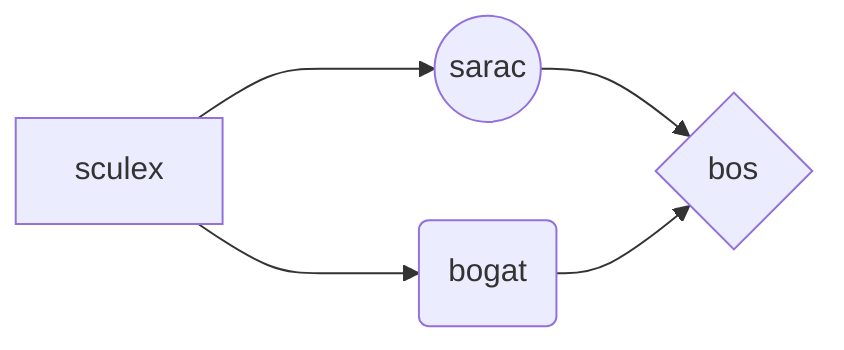
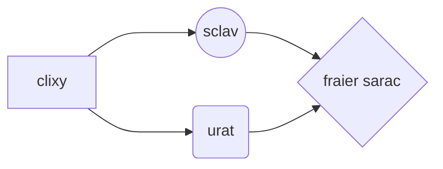

## BEFORE YOU GO
Selfbots are strictly against the Discord Terms of Service. Using this selfbot is basically screaming: "BAN ME NOW, DISCORD!"

Do whatever at your own risk. Just saying once again that if anybody doesn't like you and they send an email to abuse@discordapp.com, say goodbye to your account
# BOSI

Bosi is a discord.js v13 selfbot made for fun and troll, that can spam from a **.txt** file every single line, it's nothing complicated with command handlers and all other shits.

# Setup
is the easiest part and can be completed in a few steps:
- Make sure you have [nodejs.org](https://nodejs.org/) installed.
- Edit the `config.json` file with your id and your token from the account you want to run selfbot
- Run **npm install** command.

	> If npm install isn't installing certain packages use direct argument: **npm install discord.js-selfbot-v13**

## Start Bosi SelfBot

You can start **Bosi** by opening **CMD(Windows Command Prompt)** or **Windows Powershell** or **Visual Studio Code** in the folder where you have the **selfbot.js** file and type **node .** or **node selfbot.js**. If you're on MacOS(losers like me) open **Terminal** or **Visual Studio Code** and follow the earlier steps.

## USE AT OWN RISK ⚠️
